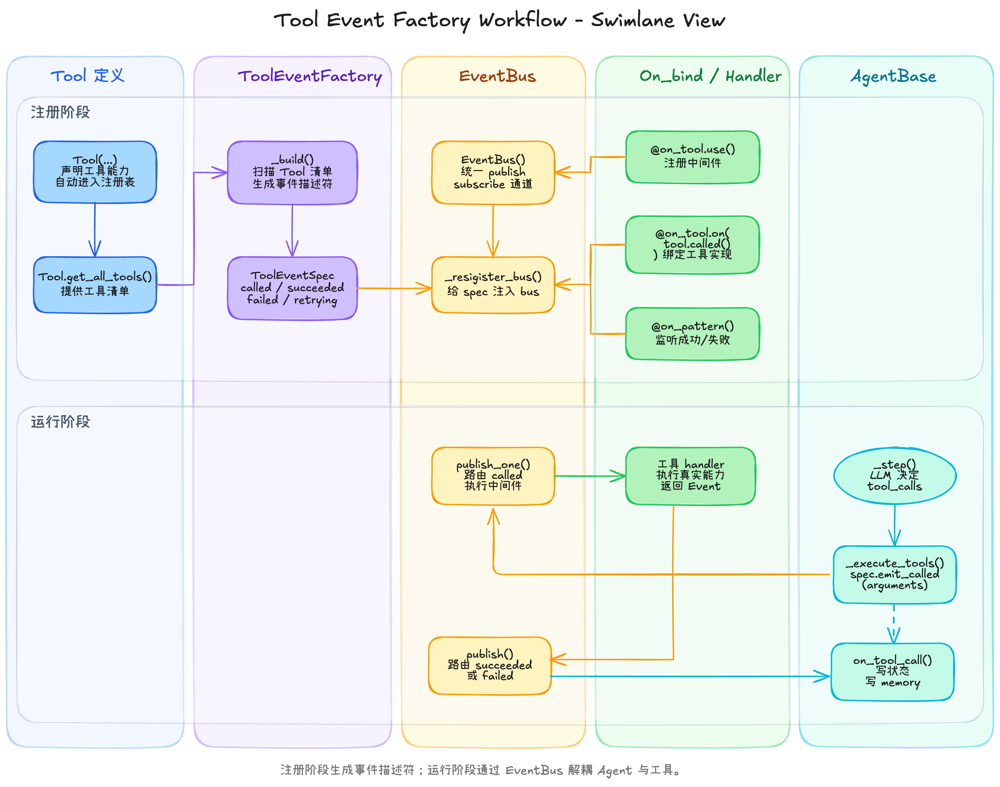
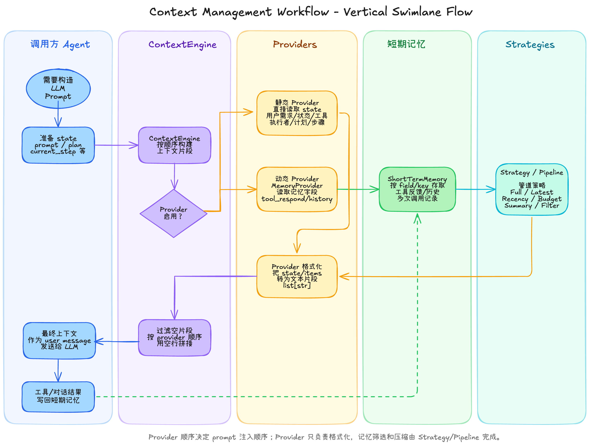
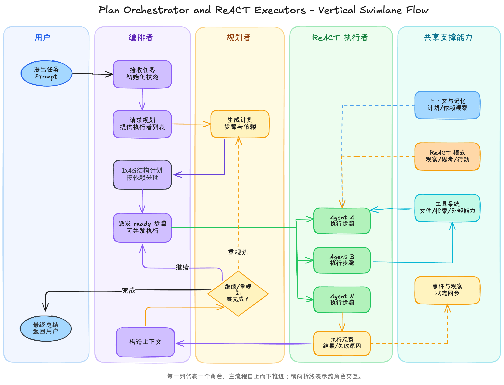

## 项目简介

这是一个harness架构，目前在持续推进中
目前已经实现功能

基于EDA的工具注册调用流，包含工具的注册，回调，中间件注册等，支持工具的并发调用

上下文管理类实现，定义了上下文管理和上下文提供两个逻辑，可以为agent注入不同的上下文提供商，来构造agent上下文，并且可以为不同的上下文提供商选择不同的上下文管理策略，来对上下文进行管理


内置agent类型：

base agent, 构建agent基类模型，为ReACT形式

plan agent构建，基于agent基类构建计划型agent

构建编排者-执行者模式，Orchestrator 根据plan agent生成任务编排多个 executor agent
其中任务生成为DAG形式，每次入度为0的任务节点并发多个executor agent任务执行

[agent_flow 网页前端展示](https://github.com/zxcvbzzy1/agent_flow_web_front)

## 项目架构

项目采用应用层 / 领域层 / 基础设施层分层：

- `api/`：FastAPI HTTP/SSE 适配层，负责路由、CORS、依赖注入和对外接口。接口详情见 [FastAPI API 文档](api/README.md)。
- `application/`：应用层用例服务，负责工具注册、ContextEngine 管理、Agent 工厂、Run 编排、会话消息、前端事件桥接。
- `domain/`：领域模型与抽象能力，包括 Agent、Tool、Event、Context、State、Memory。
- `infra/`：基础设施实现，包括事件总线、LLM 客户端、工具实现、配置装配。
- `domain/agent/`：具体 Agent 模式，包括 ReACT 执行型 Agent、PlanAgent 能力对象、多 Agent 编排者。
- `infra/tool/`：工具声明、工具事件绑定、工具具体实现。


## 工具注入与事件调用流程

### 流程示意图




### 涉及文件

1. `domain/tool.py`
   - 定义 `Tool`、`Tool_respond`。
   - `Tool` 用于描述工具名、说明、参数 schema、工具领域 `field`。
   - 所有实例化过的 `Tool` 会自动注册到 `Tool._registry`，供 prompt 注入和事件工厂构建使用。

2. `domain/event.py`
   - 定义 `Event`、`EventBusPort`、`ToolEventFactory`、`ToolEventSpec`。
   - `ToolEventFactory` 根据已注册的 `Tool` 自动生成事件名。
   - domain 层只依赖 `EventBusPort` 抽象，不依赖 `infra.eventbus.EventBus` 具体实现。

3. `infra/eventbus.py`
   - 事件总线具体实现。
   - 负责事件发布、订阅和中间件调用。

4. `infra/event_bind.py`
   - 定义 `On_bind`，用于把事件绑定到具体处理函数。

5. `infra/tool/builtin/declare.py`
   - 放通用工具声明，例如 `confirm_human`。

6. `infra/tool/builtin/system.py`
   - 声明并实现系统工具，例如 `bash`。
   - `SystemTool` 内置高危命令审核和工作目录审核。


7. `infra/tool/tools_attach_methods.py`
   - 绑定工具事件到具体工具实现。
   - 处理工具成功 / 失败事件，并回调对应 executor agent 的 `on_tool_call()`。

8. `infra/tool/common_func.py`
   - 工具执行通用函数
   - 包含用户交互相关函数


### 工具声明

工具通过实例化 `Tool` 声明：

```python
from domain.tool import Tool

BASH = Tool(
    name="bash",
    description="执行 bash 命令，执行前会审核高危命令和工作路径",
    field="system",
    input_schema={
        "type": "object",
        "properties": {
            "command": {"type": "string", "description": "要执行的 bash 命令"}
        },
        "required": ["command"],
    },
)
```

`Tool` 会被 `AvailableToolsProvider` 注入到 ReACT executor prompt 中，格式包括：

- 工具名
- 工具说明
- 参数 schema
- 工具 field


### 工具事件生成

`ToolEventFactory` 会为每个工具生成标准事件名：

```text
{prefix}.{field}.{tool_dot_name}.{suffix}
```

默认 suffix：

```python
["called", "succeeded", "failed", "retrying"]
```

示例：

```text
infra.system.bash.called
infra.system.bash.succeeded
infra.system.bash.failed
infra.system.bash.retrying
```

运行时由 `infra/config.py` 完成构建与事件总线注入：

```python
bus = EventBus()
factory = ToolEventFactory(prefix="infra")._build()._resigister_bus(bus)
```


### 工具调用链

1. ReACT executor 在 `_think()` 中生成 `tool_calls`。
2. `AgentBase._execute_tools()` 并发执行本轮 tool calls。
3. `AgentBase._run_one()` 通过事件工厂发布工具 called 事件：
   ```python
   await self.tool_factory.tool(tc.tool_name).emit_called(
       {**tc.arguments, "agent_id": self.id}
   )
   ```
4. `On_bind` 找到对应工具实现并执行。
5. 工具实现返回 `factory.tool(name).succeeded(respond)` 或 `failed(respond)`。
6. `tools_attach_methods.py` 中的 `*.succeeded` / `*.failed` 统一回调：
   ```python
   await agent.on_tool_call(tool_name=..., success=True, respond=...)
   ```
7. `AgentBase.on_tool_call()` 更新 executor 自己的 state 与 memory。


### 工具实现绑定

单工具事件绑定：

```python
@on_tool.on(factory.tool("bash").called())
async def bash_called(**kwargs) -> Event:
    command = kwargs.get("command", "")
    agent_id = kwargs.get("agent_id", "")
    ...
```

模式匹配绑定：

```python
@on_tool.on_pattern("*.succeeded")
async def on_tool_success(**kwargs):
    agent_id = kwargs.get("agent_id")
    agent = agent_dict.get(agent_id)
    await agent.on_tool_call(...)
```

单事件绑定用于具体工具实现；模式绑定用于统一成功 / 失败回调、日志、中间件等横切逻辑。


### 工具执行前的人类确认


如果某些工具在执行前需要人类确认，例如 `bash`、文件写入、外部发送、删除、发布等

在`Tool`中添加` metadata={"require_human_confirm": True}`如

```python
from domain.tool import Tool

BASH = Tool(
    name="bash",
    description="执行 bash 命令，执行前会审核高危命令和工作路径",
    field="system",
    input_schema={
        "type": "object",
        "properties": {
            "command": {"type": "string", "description": "要执行的 bash 命令"}
        },
        "required": ["command"],
    },
    metadata={"require_human_confirm": True}
)
```

可自行编辑人工交互行为函数，并绑定到工具上，如

绑定事件，事件名为`human.{tool_name}`,如
```python
@on_tool.on(Event("human.bash"))
async def confirm(**kwargs) -> Event:
```

其中`kwargs`包含

```python
{
    "tool_name": tool_name,
    "called_event_name": event.name,
    "arguments": arguments, # arguments包含工具input_schema 与 agent_id
}
```

通用用户确认函数为
`ask_human_input`


## 上下文管理流程

### 流程示意图



### 涉及文件

1. `domain/context/context.py`
   - 定义 `ContextEngine`。
   - 按 providers 注册顺序拼接 prompt。

2. `domain/context/providers.py`
   - 定义通用 providers。
   - 包括 `UserPromptProvider`、`StateProvider`、`AvailableToolsProvider`、`HistoryProvider`、`ToolOutputProvider`。

3. `domain/agent/plan/providers.py`
   - 定义 Plan 模式专属 providers。
   - 包括 `ExecutorStatusProvider`、`PlanStepPromptProvider`、`PlanObservationProvider`。

4. `domain/context/strategy.py`
   - 定义上下文策略和 `|` 管道组合。

5. `domain/memory/short/default_short_term_memory.py`
   - 默认短期记忆实现。


### Provider 分类

静态 Provider：数据来自传入的 state，不直接读取 memory。

| Provider | 文件 | 注入内容 |
|---|---|---|
| `UserPromptProvider` | `domain/context/providers.py` | 用户原始需求 |
| `StateProvider` | `domain/context/providers.py` | 当前执行状态 |
| `AvailableToolsProvider` | `domain/context/providers.py` | 当前可用工具列表 |
| `AvailableExecutorsProvider` | `domain/agent/plan/providers.py` | PlanAgent 可用执行者名称与能力描述 |
| `ExecutorStatusProvider` | `domain/agent/plan/providers.py` | Orchestrator 中的 executor 状态 |
| `PlanStepPromptProvider` | `domain/agent/plan/providers.py` | 单个计划步骤的执行 prompt |
| `PlanObservationProvider` | `domain/agent/plan/providers.py` | 已完成 / 失败 / 跳过步骤 observation |

动态 Provider：数据来自 `ShortTermMemory`，并经过 strategy 处理。

| Provider | 记忆字段 | 默认策略 |
|---|---|---|
| `ToolOutputProvider` | `tool_respond` | `FullHistoryStrategy()` |
| `HistoryProvider` | `agent_history` | `FullHistoryStrategy()` |


### ContextEngine 组装

ReACT executor 使用执行型上下文：

```python
providers = [
    UserPromptProvider(),
    StateProvider(),
    AvailableToolsProvider(["system", "search", "memory", "write_agent"]),
    HistoryProvider(memory, "agent_history", FullHistoryStrategy()),
    ToolOutputProvider(memory, "tool_respond", FullHistoryStrategy()),
]

engine = ContextEngine(providers=providers, memory=memory)
```

PlanAgent 使用编排型上下文：

```python
plan_providers = [
    UserPromptProvider(),
    StateProvider(),
    ExecutorStatusProvider(),
    PlanObservationProvider(),
    HistoryProvider(memory, "agent_history", FullHistoryStrategy()),
    ToolOutputProvider(memory, "tool_respond", FullHistoryStrategy()),
]

plan_engine = ContextEngine(providers=plan_providers, memory=memory)
```

PlanOrchestrator 给 executor 构造单步任务 prompt 时使用：

```python
step_context_engine = ContextEngine(
    providers=[PlanStepPromptProvider()],
    memory=memory,
)
```


## Agent 体系

### 流程示意图



### AgentBase

文件：`domain/agent_base.py`

`AgentBase` 是 ReACT executor 的基础类，负责：

- 保存 agent 自己的 `states`。
- 通过 `ContextEngine.build(state)` 构造 prompt。
- 调用 LLM 生成结构化决策。
- 解析 `tool_calls`。
- 通过 `ToolEventFactory` 发布工具调用事件。
- 在 `on_tool_call()` 中接收工具执行结果，更新自身 state 和 memory。

`AgentBase` 不持有 `EventBus`。工具事件总线由 `ToolEventFactory` 和 `infra/config.py` 注入。


### ReACT Executor Agent

示例：`domain/agent/write/writeAgent.py`

`WriteAgent` 继承 `AgentBase`，重写 `_build_agent_prompt()`，继续复用：

- 工具注册工厂
- ContextEngine
- memory
- 工具事件回调 `on_tool_call()`

executor 的执行入口仍然是：

```python
await executor.start(prompt)
```


### PlanAgent

文件：`domain/agent/plan/planAgent.py`

`PlanAgent` 不再是工具，也不再执行工具调用。它是 planner 能力对象，负责：

- `generate_plan(state, executor_ids)`：生成结构化计划。
- `replan_after_observation(plan, state)`：根据 observation 判断 continue / replan / finish。
- `summarize_result(state)`：汇总最终结果。

计划结构：

```json
{
  "steps": [
    {
      "step_id": "A",
      "title": "读 README",
      "detail": "读取 README 并提取项目说明",
      "executor_id": "writer_001",
      "depends_on": []
    }
  ]
}
```


### PlanOrchestrator

文件：`domain/agent/plan/orchestrator.py`

`PlanOrchestrator` 是多 Agent 编排者，持有：

- `planner: PlanAgent`
- `executors: dict[str, AgentBase]`
- `state: OrchestratorState`
- `step_context_engine: ContextEngine`
- `event_bus: EventBusPort | None`

`OrchestratorState` 是编排状态，不替代 executor agent 自己的 `states`：

```python
@dataclass
class OrchestratorState:
    prompt: str = ""
    executors: dict[str, dict] = field(default_factory=dict)
    plan: dict = field(default_factory=dict)
    current_step: dict | None = None
    final: str = ""
    is_finished: bool = False
    finish_reason: str = ""
```

`PlanOrchestrator` 的完整入口：

```python
await orchestrator.start(prompt)
```

执行流程：

1. `_dispatch({"event_dispatch": "workflow.started", "playload": {...}})` 初始化编排状态。
2. 调用 `planner.generate_plan(...)` 生成计划。
3. `_dispatch({"event_dispatch": "plan.generated", "playload": {"plan": plan}})` 保存计划快照。
4. 按 `depends_on` 找出 ready steps。
5. 同一轮 ready steps 使用 `asyncio.gather()` 并发执行。
6. 每个 executor 收到局部 step state 生成的 prompt，不写共享 `current_step`。
7. executor 完成后同步读取 executor state，写入 step observation。
8. wave 完成后 `_dispatch({"event_dispatch": "wave.completed", ...})` 刷新编排快照。
9. 调用 `planner.replan_after_observation(...)` 动态判断是否继续、更新 pending step 或提前结束。
10. 所有步骤完成后调用 `planner.summarize_result(...)`，写入 final。


### Orchestrator State Dispatch

Orchestrator 内部状态统一通过 `_dispatch(action)` 更新。

action 结构：

```python
{
    "event_dispatch": "workflow.started",
    "playload": {
        "prompt": "用户需求"
    }
}
```

当前支持的 `event_dispatch`：

- `workflow.started`
- `plan.generated`
- `wave.completed`
- `plan.replanned`
- `workflow.finished`

注意：这里的 `playload` 是当前代码中的字段名。


## 多 Agent 编排示例

```python
from domain.agent.plan.orchestrator import OrchestratorState, PlanOrchestrator
from domain.agent.plan.planAgent import PlanAgent
from domain.agent.plan.providers import PlanStepPromptProvider
from domain.agent.write.writeAgent import WriteAgent
from domain.context.context import ContextEngine

planner = PlanAgent(
    id="planner_001",
    name="Planner",
    llm=llm_client,
    context=plan_engine,
)

writer_001 = WriteAgent(
    id="writer_001",
    name="Writer 1",
    llm=llm_client,
    context=engine,
)

step_context_engine = ContextEngine(
    providers=[PlanStepPromptProvider()],
    memory=memory,
)

orchestrator = PlanOrchestrator(
    planner=planner,
    executors={"writer_001": writer_001},
    state=OrchestratorState(),
    step_context_engine=step_context_engine,
    event_bus=bus,
)

await orchestrator.start("请分析项目并生成总结")
print(orchestrator.state.final)
```


## 目录速览

FastAPI 后端接口、请求体、SSE 事件和启动方式请跳转到：[api/README.md](api/README.md)。

```text
api/
  index.py                         # FastAPI app、CORS、/health、业务路由挂载
  README.md                        # FastAPI 接口与启动说明
  core/
    config.py                      # API 配置、MongoDB、CORS origins
    dependencies.py                # ServiceContainer 与依赖注入
  tools/
    router.py                      # 工具查询、上传、删除
    schemas.py                     # 工具 API 请求体
  contexts/
    router.py                      # ContextEngine catalog、创建、查询、删除
    schemas.py                     # Context API 请求体
  agents/
    router.py                      # Agent 查询、创建、删除
    schemas.py                     # Agent API 请求体
  runs/
    router.py                      # React/Plan run、SSE、确认、中断
    schemas.py                     # Run API 请求体
  conversations/
    router.py                      # 会话、消息、会话消息启动 run、删除会话
    schemas.py                     # 会话 API 请求体

application/
  services/
    tools.py                       # 工具加载、上传、删除与事件 spec 刷新
    contexts.py                    # ContextEngine catalog、模板、provider/strategy 管道组装
    agents.py                      # Planner/Executor 工厂与运行时实例管理
    runs.py                        # React/Plan run 创建、执行、取消、历史写回
    conversations.py               # 会话与消息管理
    events.py                      # 前端 SSE 事件持久化、队列与格式化
    llm_streaming.py               # LLM 流式输出转前端事件
  events/
    bridge.py                      # 内部事件到前端 SSE 的桥接
    human_confirmation.py          # 网页人类确认 pending/resolve 管理
    schemas.py                     # 前端事件 payload 构造
  agent/
    bash_agent.py                  # bash ReACT agent 应用示例
    story_write_agent.py           # 故事写作 ReACT agent 应用示例
    orchestrator_executors.py      # 编排者-执行者应用示例

domain/
  agent_base.py                    # ReACT executor 基类
  tool.py                          # Tool / Tool_respond
  event.py                         # Event / EventBusPort / ToolEventFactory
  state.py                         # Agent_state / Plan / PlanStep
  runtime_hooks.py                 # 运行时端口：工具事件观察、人类确认、run context
  agent/
    plan/
      planAgent.py                 # Planner 能力对象
      orchestrator.py              # 多 Agent 编排者
      providers.py                 # Plan 专属 providers
  context/
    context.py                     # ContextEngine
    providers.py                   # 通用 providers
    strategy.py                    # Context strategies
  memory/
    short/
      default_short_term_memory.py

infra/
  config.py                        # 运行时依赖装配
  eventbus.py                      # EventBus 具体实现
  event_bind.py                    # 事件绑定器
  LLM/
    LLM_infra.py                   # LLM 客户端与流式基础能力
  db/
    mongodb.py                     # MongoDB + 内存 fallback 文档存储
    milvus_rag.py                  # Milvus/RAG 基础设施
  context/
    db_strategy.py                 # 文件/数据库相关 context strategy
  tool/
    builtin/
      declare.py                   # 通用工具声明
      system.py                    # bash 工具声明和实现
      story_write.py               # 写作工具声明、注册和实现
    tools_attach_methods.py        # 通用中间件与工具成功/失败回调
    common_func.py                 # 工具事件辅助函数
```
